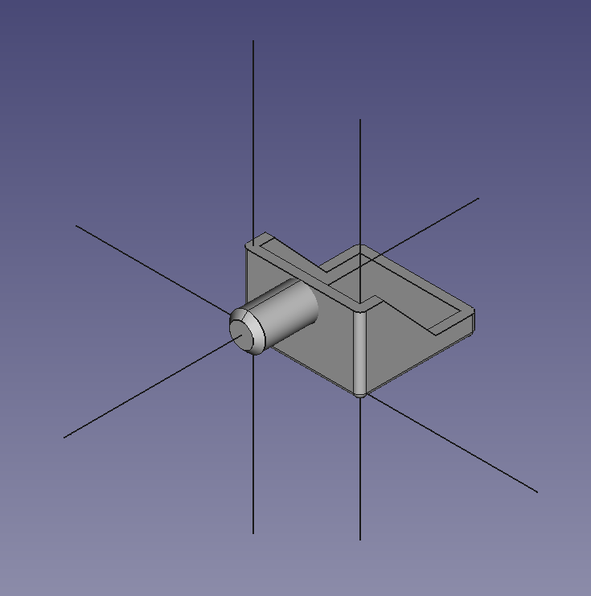
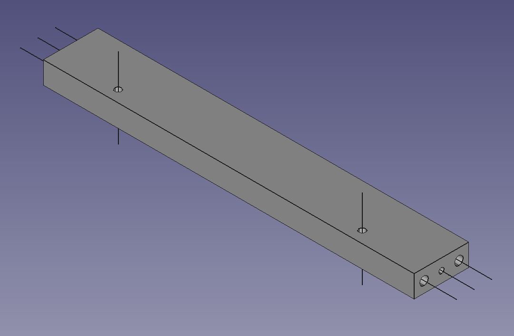
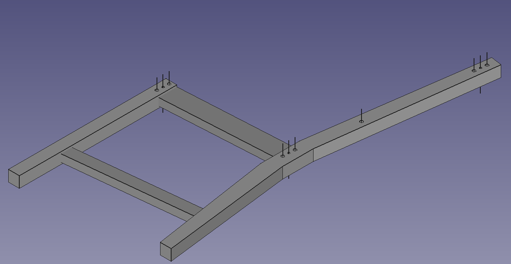

# subaxis_extractor

detect cylindrical objects from CAD file (.STEP) to propose sub-axis candidates





## Requirements

- python 2.7
- freecad
- pyqt4
- argparse
- tqdm
- json

## directory sturcture

```
+-- step # input step files
    +-- stefan

+-- hole_info # output sub-axis
    +-- part1.json
    +-- part2.json

+-- obj # output .obj file
    +-- part1.obj
    +-- part2.obj
```

## data format

```
{
"file_id": int,
"file_name": str,
"EA": int,
"holes": [hole]
}

hole{
"hole_id": int,
"radius": int,
"position", [x, y, z],
"x_axis", [nx, ny, nz],
"y_axis", [nx, ny, nz],
"z_axis", [nx, ny, nz],
}

```

## references

- https://forum.freecadweb.org/viewtopic.php?t=5059

## how-to-use

```
python detect_holes_from_STEP.py --i {input_folder}, --o {output_folder} --gui 5
```
